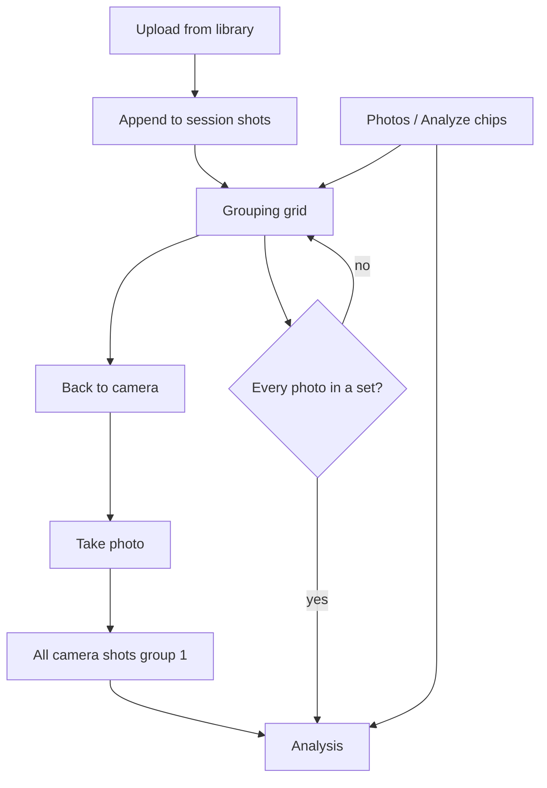

# Manual photo set grouping

Camera captures stay **one device / one group** and go straight to analysis. A multi-select from the library saves the photos in the session and opens a grouping grid first. Gemini still names views; it does not invent groups when the user already assigned them.

## Session shots

Shots persist through [mobile/src/photoStore.js](mobile/src/photoStore.js) (document folder `device-shots/`, plus the in-memory cache in [mobile/src/sessionShots.js](mobile/src/sessionShots.js)). Camera **Clear** still wipes both. Each shot keeps:

- `source`: `"camera"` or `"library"`
- `groupId`: `1` for camera shots; `null` until assigned for library shots

`takePhoto` assigns `groupId: 1` and navigates to Analysis as today.

`pickPhoto` appends library shots with `groupId: null` and navigates to a new **Grouping** screen (not Analysis). If the session already has camera shots, they appear on the grid already badged as set 1.

## Grouping screen

New [mobile/screens/GroupingScreen.js](mobile/screens/GroupingScreen.js), registered in [mobile/App.js](mobile/App.js). Same 2-column 3/4 grid as Analysis `PhotoGrid` in [mobile/screens/AnalysisScreen.js](mobile/screens/AnalysisScreen.js) (`FALLBACK_ASPECT`, cell math). Do not reuse the roller.

Interaction (select-then-create):

- Tap an unbadged photo to select it (teal outline). Tap again to deselect.
- **Create Set** is enabled only when at least one photo is selected. Those photos become the next set number (lowest unused integer: 1, 2, 3…).
- Tap a badged photo to **remove it from its set** (badge clears; it must be selected and Create Set again to reassign).
- **Back to camera** keeps persisted shots. Camera **Photos** / **Analyze** reopen this menu or analysis.
- **Analyze** is disabled until every photo has a `groupId`.

Copy: Photos, Create Set, Remove from set, Delete, Analyze. Unassigned count can sit under the grid. Do not add a UI kit. Tokens stay in [mobile/src/theme.js](mobile/src/theme.js).

## Badges

Shared [mobile/src/SetBadge.js](mobile/src/SetBadge.js): small number in the **upper-right** of the image, color by set number. Palette on `theme.setColors` — distinct from usable / retake / needs_review (teal, peach, ink-blue, etc., cycling).

Use the same badge on:

- Grouping grid
- Analysis hold-to-grid (`PhotoGrid` only; do not change roller physics)

Analysis checklist labels become **Set 1**, **Set 2** (not “Device N”) when these user groups are present.

## Analysis and API

[mobile/src/api.js](mobile/src/api.js): each shot in `/analyze/payload` includes `group_id` when set (string `"1"`, `"2"`, …).

[api/main.py](api/main.py) `ShotPayload` gains optional `group_id`. In `_analyze_items`:

- Known Capture_Coach hash/fingerprint views stay as they are (so `check_views` is unchanged).
- Unknown photos: Gemini names **view only**. If the client sent `group_id`, keep it. Do not let Gemini overwrite user sets.
- Camera / single-group uploads with every shot `group_id=1` skip Gemini grouping the same way.

`build_groups` already buckets by `group_id`; quality gates stay local.

## Docs and verify

Update [README.md](README.md) and [AGENTS.md](AGENTS.md): camera = one group; library = grouping grid; Done requires full assignment; analysis grid shows set badges.

Verify on device / Expo (not a single screenshot):

- Take photos: no grouping screen; one checklist
- Upload several photos: grid, Create Set, Done disabled while any photo is unassigned
- Return to photos, add more, finish assignment, analyze
- Hold center photo: grid cells keep set number + color
- Practice-set path and `python -m api.check_api` still pass

## Implementation checklist

- Add `source` / `groupId` on shots; camera skips grouping, library opens Grouping
- After Return, camera **Create set** chip reopens the grid when a library shot is in the session
- Grouping grid: select, Create Set, unassign, Return to photos, Done gated
- Shared SetBadge + `theme.setColors` on grouping and Analysis PhotoGrid
- Pass `group_id` on payload; Gemini names views only when client groups exist
- Update README/AGENTS; verify camera, upload grouping, analysis grid badges
