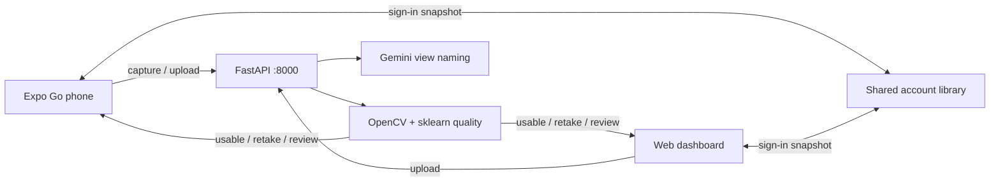

# ScanE

**Tagline:** Capture coach for equipment photos — usable, retake, or needs review.

An AI camera assistant that helps someone photograph electronic equipment correctly. Take or upload **front**, **rear / ports**, and **label** photos; ScanE checks whether each shot is usable, needs a retake, or needs a person to look, then tells you what to fix.

Built for the **American Circular Capture Coach** track at Bay Hacks: evaluate device photos for blur, lighting, framing, obstructed labels, and missing required views, and give immediate retake instructions.

<p align="center">
  
</p>

**Devpost gallery:** attach a 2–3 minute demo video plus screenshots of Camera, Storage, Analysis (roller + Problem / Solution), and the web dashboard. Live prototype: phone in Expo Go + [http://127.0.0.1:8000/dashboard/](http://127.0.0.1:8000/dashboard/) on the API host.

---

## Inspiration

Circular-economy shops photograph scrap electronics so someone later can identify the chassis, see the ports, and read the label — an asset tag, spec plate, sticker, or any other marking on the device. A blurry label or a cropped rear panel wastes a trip. The Capture Coach challenge asked for a prototype that coaches that capture in the moment, without claiming to identify a device, read serials, or certify erasure.

ScanE is that coach: a phone camera for the bench, a web dashboard for review, and a shared library so the same account can shoot on a phone and inspect on a laptop.

## What it does

An operator captures or uploads photos of a device. ScanE:

1. Names each photo as **front**, **rear_ports**, or **label** (Gemini by default). **label** is any identification label in the photo (nameplate, serial/asset sticker, barcode plate, DEMO tape, or similar), not only DEMO tape. Client view chips are hints, not labels.
2. Groups shots into device **sets** (one chassis per set) and checks the required-view checklist.
3. Scores capture quality locally: blur, underexposure, glare / overexposure, framing, and whether the label is covered or unreadable.
4. Returns **Usable**, **Retake**, or **Needs review**, plus a **Problem** and a **Solution** in plain language.

The **label** view is any equipment label meant to be read — asset tag, spec plate, sticker, or other marking — not a specific tape color or DEMO sticker.

A missing view is a set-level finding. A bad photo of a view that is present is a retake, not “missing.” Dark table backgrounds and black privacy boxes are not defects.

| Status | Meaning |
| --- | --- |
| **Usable** | Adequate for the intended view |
| **Retake** | A clear failure (blur, dark, glare, cut-off frame, covered or unreadable label, …) |
| **Needs review** | The model cannot decide (uncertain view, unclear rear ports, ambiguous brightness) |

### Use cases

- **Bench capture.** Photograph a device on the phone (shutter stays on Camera). Analyze the current session, or group shots in Storage first.
- **Desk review.** Sign in at [http://127.0.0.1:8000/dashboard/](http://127.0.0.1:8000/dashboard/) with the same username as the phone Profile, upload files, and inspect the shared library. The dashboard has no camera. Photos already synced as `alejj12` (20) or `alejj1216` (25) appear only under that username.
- **Set completeness.** Create Set 1, Set 2, … so each chassis has its own front / rear / label checklist. Unassigned photos are stored but not analyzed from Storage.
- **Retake coaching.** After analysis, swipe the photo roller. Each shot shows view, status, and Problem / Solution copy such as “add light” vs “change angle.”
- **Practice-set checks.** With the Capture Coach student package, the server can still score the published photo sets (`/sets`, `/analyze/set`) the way the challenge described.

## How we built it



| Layer | Stack | Role |
| --- | --- | --- |
| Phone | Expo SDK 57, React Native 0.86, React 19, Expo Go | Camera, Storage, Analysis roller, Profile. Stay in Expo Go. |
| Dashboard | Static HTML / JS / CSS, Shoelace 2 (CDN) | Upload-only Storage + Analysis, served at `/dashboard/` |
| API | FastAPI, Uvicorn, port 8000 | Analyze, accounts, shared library, dashboard files |
| View naming | Google Gemini (`gemini-3.1-flash-lite`) | Names front / rear / label and groups unknown chassis. Examples only, not an allowlist. |
| Quality | OpenCV + scikit-learn logistic models (`models/blur_exposure.joblib`) | Blur, exposure, glare, framing, label obstruction. Runs on the API host. |
| Guidance | `models/guidance.json` from practice labels | Problem / Solution sentences, not free-form LLM copy |
| Sync | `POST /account/login`, `GET`/`PUT /account/snapshot`, `GET /account/photos/{id}` | Same username on phone and web. After a snapshot pull, the dashboard loads each photo as a JPEG (`Content-Disposition: inline`) and shows a blob URL. |

**Where AI contributes.** Gemini names the view and (when the client did not send a set id) groups photos by chassis. Local measurements decide usable / retake / needs_review. ScanE does **not** OCR the label, recover privacy boxes, identify a brand, or certify data erasure. It checks that a label photo is complete and readable enough to use.

**Network and cost.** Analyze posts JSON (base64 JPEGs, max side 960) to `/analyze/payload`. Gemini receives those working copies for unknown photos; known practice images match by hash / filename / fingerprint and skip the API call. Originals stay on the phone or in the account library. A Google AI API key is required when `ANALYZE_BACKEND=gemini` (the default). Flash-Lite is a low-cost hosted model; there is no silent fallback to the local view forest if the key is missing.

Phone and dashboard share one theme (`mobile/src/theme.js`). Analysis is a center-anchored photo roller on both; the phone holds for one second to open Storage, the dashboard hold opens the in-page grid.

## Challenges we ran into

**Missing is not a retake.** A blurry front photo still counts as a front. The checklist is per device set, and a present-but-bad view must not be reported as absent. That split is easy to get wrong in a UI that also groups chassis.

**Do not trust the chip.** Operators tap Front / Rear / Label as a hint. Practice checks deliberately send the wrong chip and a generic filename. The server has to name the real view, or the guidance is attached to the wrong photo.

**Campus Wi-Fi vs a laptop API.** Eduroam can block phone-to-PC LAN. Health probes that hang never reach Gemini and leave Analysis stuck on **Analysis in Progress**. The phone tries LAN Metro, then the current Expo host, then the Expo tunnel, and treats an HTTP status (including 502) as “this Metro is alive” so a down Uvicorn is a 502, not a freeze. A 503 from analyze means view naming failed on that live server; hopping origins would hide the real error.

**Gemini 3 thinks out loud.** The model can return a thought object before the `photos[]` JSON. The server skips objects that lack `photos[]`, ignores thought parts, sets thinking to minimal, and retries the call once.

**Show the original, score a copy.** Challenge rules forbid passing an enhanced image off as the capture. Previews stay the stored originals. Only the upload copy is resized (max side 960, JPEG ~0.75) for analyze.

**Two clients, one library.** Phone document storage and the web dashboard both read and write assigned and unassigned photos. Unassigned shots are never analyzed from Storage, except a one-photo camera session. Sync runs after sign-in, analyze, and grouping or delete, and only when a session token exists. A dashboard `GET /account/snapshot` 401 signs the page out; it must not leave an empty Storage grid that says “All photos are in a set.”

## Accomplishments that we're proud of

- A **live camera** flow (optional in the track) plus an upload dashboard, so a bench phone and a review laptop share one account.
- **Hybrid AI** that matches the judging brief: local quality models and PHOTO_GUIDE rules decide status; Gemini only names views on unknown photos.
- On the 34 practice images, issue codes, statuses, and phone-style view labels match the published answers, while a full set can still contain retakes.
- Operator-facing **Problem** and **Solution** copy instead of raw issue codes — including two lighting codes so the instruction can say “add light” or “change angle.”
- Analysis that does not blank the screen: photos stay up, cached shots show their last status immediately, and a failed call keeps the roller.
- Unchanged shots reuse the last analyze rows on the phone so a second pass does not re-upload the whole set.

## What we learned

Useful capture coaching is mostly **rules plus measurements**, with a vision model only where a chip or filename cannot be trusted. Spending more on a larger model would not have scored the blur and glare gates better; those are OpenCV features and logistic models trained on the practice labels.

Expo Go on a campus network taught us that “the API is on localhost” is not a product. Probes need timeouts, 502 from Metro means Uvicorn is down, and the tunnel has to stay in the path.

We also learned to leave **uncertain** as needs-review instead of filling a checklist slot with a guess. A wrong view in the green list is worse than an empty one.

## What's next for ScanE

More labeled extra views (`data/extra_views/`) for tougher devices, a fully local view backend when a site cannot call Gemini, and tighter operator copy as the practice catalog grows.

---

## Try it out

### Prerequisites

- Python 3.10+ and Node.js 20+
- [Expo Go](https://expo.dev/go) (SDK 57) on a phone, or an emulator
- A [Google Gemini API key](https://ai.google.dev/) for live view naming
- Optional: the Circular Capture Coach student package (34 practice images). Needed to retrain, to score published `/sets`, and to send Gemini the six exemplar photos. Point `CAPTURE_COACH` in `api/config.py` at that folder.

Quality weights already live in `models/`. You can run the server without retraining.

### 1. API server

From the repo root:

```text
python -m pip install -r requirements.txt
```

Create a project `.env` (never commit it):

```text
GEMINI_API_KEY=your_key_here
```

Optional:

```text
ANALYZE_BACKEND=gemini
GEMINI_MODEL=gemini-3.1-flash-lite
```

Retrain only if you have the student package and want new quality weights (a few minutes):

```text
python -m api.train
```

Start the server:

```text
python -m uvicorn api.main:app --host 0.0.0.0 --port 8000
```

After any `api/` change or retrain, restart Uvicorn so the phone and dashboard load the new code and weights.

**Web dashboard:** [http://127.0.0.1:8000/dashboard/](http://127.0.0.1:8000/dashboard/) (`/` redirects there). Signed out, the navbar is the Scan-E logo only (no Storage / Analysis tabs). The sign-in card is a content-sized surface: **Welcome!**, then username, password, **Sign in**, and the hint “Use the same username and password as Profile on the phone.” First Sign in creates the account (username: letters, numbers, `_`; password 4+ characters). Sign in with that same phone username to see its library — this API already has photos for `alejj12` (20) and `alejj1216` (25). A different username is a different library. After sign-in, Storage shows the username in the navbar, a live photo count, and Refresh.

### 2. Phone app

Keep Uvicorn on port 8000. Metro proxies `/model` to that server.

```text
cd mobile
npm install
npx expo start
```

Open the project in Expo Go. The phone must be able to reach the machine running Metro and the API. Campus Wi-Fi (for example Eduroam) often blocks phone-to-PC LAN; Expo’s tunnel stays available. If Uvicorn is down, Analysis stays on **Analysis in Progress** and Gemini never receives those calls.

Display previews are the stored originals. Only the upload copy is resized for analyze.

### 3. Checks

```text
python -m api.check_api
python -m api.check_views
python -m api.check_account
```

Mobile:

```text
node mobile/src/check_profile.js
node mobile/src/check_screens.js
node mobile/src/check_analyzeCache.js
```

`check_views` needs the student package. It posts every practice image the way a library file would (wrong chip, generic filename, JPEG recompress).

## How to use it

**Camera (phone).** Bottom bar: Upload and Storage left of the shutter; session and Analyze on the right. Front / Rear / Label chips are hints. The shutter saves into the current camera set and stays on Camera. Upload saves unassigned photos and opens **Storage**. Analyze asks **This session** vs **Storage**. One photo in a session can be analyzed unassigned; two or more stay a set. Empty session: take a photo first. Empty storage sets: group photos into a set in Storage first.

**Storage (phone and web).** Filter All / Unassigned / Set N. Select photos, Create set, Add to set, Remove from set, Delete. Analyze only grouped (assigned) photos. After sign-in, grouping, delete, and analyze, the phone syncs the shared library when a session token exists. On the dashboard, Refresh re-pulls the snapshot, then each `/account/photos/{id}` image is fetched and shown as a blob URL. Tiles are a fixed 3/4 cell with min-height; the photo is both `background-image` and an `` (cover) so the cell cannot collapse. Empty library copy is “No photos on {username} yet…” plus phone **Sync now** — not “All photos are in a set” (that line is only when photos exist and all are assigned).

**Analysis.** Photos appear immediately in a center-anchored roller (swipe to change the focused shot; hold one second to open Storage on the phone, or the in-page grid on the web). Cached shots show their last status right away. Until a new result arrives, the details card says **Analysis in Progress**. Then: status, Set N, view, Problem, Solution. Issue codes are not shown in the UI. A failed analyze keeps the photos on screen.

**Profile.** Person icon on Camera (overlay), Storage header, and the dashboard tab row after sign-in. Phone Profile has **Sync now**. The dashboard navbar shows the signed-in username; Sign out is in the dropdown.

## Project layout

```text
api/         FastAPI, features, training, inference, Gemini / local view backends
mobile/      Expo Go app (Camera, Storage, Analysis, Profile)
dashboard/   Web UI (StaticFiles at /dashboard/)
models/      blur_exposure.joblib, guidance.json
assets/      Scan-E logo
data/accounts/   Per-user library (gitignored)
```

## Known limitations

- Live view naming needs `GEMINI_API_KEY`. A missing key does not fall back to the local forest (`api/backends/local_view.py` is unused while Gemini is active).
- Uncertain views are **Needs review** and do not fill that set’s checklist slot.
- Gemini may see resized working copies of photos you analyze. Do not upload customer, credential, or production records.
- The app does not verify device identity, ownership, or data destruction.
- Practice-label matching (hash / `IMG-####` filename / fingerprint) is for the student package so checks stay stable; unknown equipment goes through Gemini.

## Built with

expo · react-native · react · javascript · python · fastapi · uvicorn · opencv · scikit-learn · joblib · google-gemini · google-genai · shoelace · expo-camera · expo-image-picker
